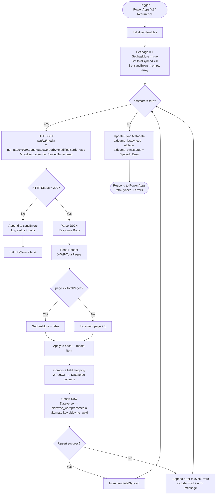

# Flow Plan: Sync WordPress Media → Dataverse

## Overview

| Property | Value |
|---|---|
| **Flow Name** | Sync WordPress Media to Dataverse |
| **Trigger** | Power Apps (V2) — or Recurrence (scheduled) |
| **Source** | `https://aidevme.com/wp-json/wp/v2/media` |
| **Target Table** | `aidevme_wordpressmedia` |
| **Upsert Key** | Alternate key on `aidevme_wpid` |
| **Strategy** | Full paginated sync with optional `modified_after` for incremental runs |

---

## Flow Diagram



---

## Step-by-Step Actions

### Step 1 — Trigger

| Option A | **Power Apps (V2)** — manually triggered from a canvas app with an optional `lastSyncedTimestamp` input parameter |
|---|---|
| Option B | **Recurrence** — scheduled (e.g. every hour). Store the last successful sync time in a Dataverse config row. |

**Recommended:** Start with Power Apps V2 for on-demand testing, then add a Recurrence trigger for production.

---

### Step 2 — Initialize Variables

| Variable | Type | Initial Value | Purpose |
|---|---|---|---|
| `varPage` | Integer | `1` | Current page number |
| `varHasMore` | Boolean | `true` | Pagination loop control |
| `varTotalPages` | Integer | `1` | Total pages from `X-WP-TotalPages` header |
| `varTotalSynced` | Integer | `0` | Count of successful upserts |
| `varSyncErrors` | Array | `[]` | Collects per-item errors |
| `varLastSynced` | String | Input param or empty | ISO 8601 timestamp for incremental sync |

---

### Step 3 — Pagination Loop (`Do Until varHasMore = false`)

Use a **Do Until** loop (not Apply to each) for the outer pagination.

#### 3a. Build the request URI

```
https://aidevme.com/wp-json/wp/v2/media
  ?per_page=100
  &page=@{variables('varPage')}
  &orderby=modified
  &order=asc
  &modified_after=@{variables('varLastSynced')}
```

> If `varLastSynced` is empty, omit `modified_after` — this performs a full sync.

#### 3b. HTTP GET action

| Setting | Value |
|---|---|
| Method | `GET` |
| URI | Expression above |
| Authentication | **Basic** (Username: WP username, Password: [Application Password](https://make.wordpress.org/core/2020/11/05/application-passwords-integration-guide/)) — store in Key Vault or as encrypted flow parameters |
| Headers | `Accept: application/json` |

#### 3c. Condition — Check HTTP status

- **If status code = 200** → continue to Parse JSON
- **Else** → append `{ "page": varPage, "status": statusCode, "body": body }` to `varSyncErrors`, set `varHasMore = false`

#### 3d. Parse JSON

- **Content:** `body` (HTTP action output)
- **Schema:** See [Parse JSON Schema](#parse-json-schema) below

#### 3e. Read pagination headers

```
// Set varTotalPages
int(outputs('HTTP')?['headers']?['X-WP-TotalPages'])
```

Set `varTotalPages` on the **first iteration only** (check `varPage = 1`).

#### 3f. Update loop control

```
// After processing items:
if(greaterOrEquals(variables('varPage'), variables('varTotalPages')),
   setVariable('varHasMore', false),
   setVariable('varPage', add(variables('varPage'), 1))
)
```

---

### Step 4 — Apply to Each (inner loop, per media item)

Iterates over `body('Parse_JSON')` — the array of media items.

#### 4a. Compose — Field Mapping

Map each WordPress field to the Dataverse column schema name.

| Dataverse Column | Expression |
|---|---|
| `aidevme_wpid` | `int(item()?['id'])` |
| `aidevme_guid` | `item()?['guid']?['rendered']` |
| `aidevme_link` | `item()?['link']` |
| `aidevme_slug` | `item()?['slug']` |
| `aidevme_type` | `item()?['type']` |
| `aidevme_date` | `item()?['date']` |
| `aidevme_dategmt` | `item()?['date_gmt']` |
| `aidevme_modified` | `item()?['modified']` |
| `aidevme_modifiedgmt` | `item()?['modified_gmt']` |
| `aidevme_status` | `item()?['status']` |
| `aidevme_authorid` | `int(item()?['author'])` |
| `aidevme_postid` | `int(item()?['post'])` |
| `aidevme_title` | `item()?['title']?['rendered']` |
| `aidevme_alttext` | `item()?['alt_text']` |
| `aidevme_caption` | `item()?['caption']?['rendered']` |
| `aidevme_description` | `item()?['description']?['rendered']` |
| `aidevme_commentstatus` | `item()?['comment_status']` |
| `aidevme_pingstatus` | `item()?['ping_status']` |
| `aidevme_template` | `item()?['template']` |
| `aidevme_mediatype` | `item()?['media_type']` |
| `aidevme_mimetype` | `item()?['mime_type']` |
| `aidevme_sourceurl` | `item()?['source_url']` |
| `aidevme_filepath` | `item()?['media_details']?['file']` |
| `aidevme_filesize` | `int(item()?['media_details']?['filesize'])` |
| `aidevme_width` | `int(item()?['media_details']?['width'])` |
| `aidevme_height` | `int(item()?['media_details']?['height'])` |
| `aidevme_camera` | `item()?['media_details']?['image_meta']?['camera']` |
| `aidevme_aperture` | `string(item()?['media_details']?['image_meta']?['aperture'])` |
| `aidevme_focallength` | `string(item()?['media_details']?['image_meta']?['focal_length'])` |
| `aidevme_iso` | `int(item()?['media_details']?['image_meta']?['iso'])` |
| `aidevme_shutterspeed` | `string(item()?['media_details']?['image_meta']?['shutter_speed'])` |
| `aidevme_orientation` | `int(item()?['media_details']?['image_meta']?['orientation'])` |
| `aidevme_credit` | `item()?['media_details']?['image_meta']?['credit']` |
| `aidevme_copyright` | `item()?['media_details']?['image_meta']?['copyright']` |
| `aidevme_datecaptured` | `addSeconds('1970-01-01T00:00:00Z', int(item()?['media_details']?['image_meta']?['created_timestamp']))` |
| `aidevme_imagekeywords` | `join(item()?['media_details']?['image_meta']?['keywords'], ',')` |
| `aidevme_thumbnailurl` | `item()?['media_details']?['sizes']?['thumbnail']?['source_url']` |
| `aidevme_mediumurl` | `item()?['media_details']?['sizes']?['medium']?['source_url']` |
| `aidevme_largeurl` | `item()?['media_details']?['sizes']?['large']?['source_url']` |
| `aidevme_fullurl` | `item()?['source_url']` |
| `aidevme_mediadetailsjson` | `string(item()?['media_details'])` |
| `aidevme_imagemetajson` | `string(item()?['media_details']?['image_meta'])` |
| `aidevme_metajson` | `string(item()?['meta'])` |
| `aidevme_lastsynced` | `utcNow()` |
| `aidevme_syncstatus` | `"Synced"` |

#### 4b. Upsert Row (Dataverse)

| Setting | Value |
|---|---|
| Action | **Add a new row** with **Upsert** (or use "Update a row" with the alternate key if using the Premium Dataverse connector) |
| Table | `aidevme_wordpressmedia` |
| Alternate Key | `aidevme_wpid = int(item()?['id'])` |
| Row data | Composed object from 4a |

> Use the **Dataverse (current environment)** connector → **Add a new row** action, then under "Advanced parameters" select the alternate key `aidevme_wpid` to enable upsert behaviour.

#### 4c. Error handling on Upsert

Wrap the upsert in a **Configure run after** (set to run on failure) to catch errors:

```
// On failure branch:
Append to array variable — varSyncErrors
{
  "wpid": item()?['id'],
  "title": item()?['title']?['rendered'],
  "error": @{actions('Upsert_Row')?['error']?['message']}
}
// Set aidevme_syncstatus = "Error" for this item (optional separate upsert)
```

---

### Step 5 — Post-loop cleanup

After `Do Until` completes:

1. **Set `varLastSynced`** → `utcNow()` — store this value back to a Dataverse config row or an environment variable so the next incremental run uses it.
2. **Condition — any errors?**
   - If `length(varSyncErrors) > 0`: log a summary row or send an email via Office 365 Outlook.

---

### Step 6 — Respond to Power Apps

```json
{
  "totalSynced": @{variables('varTotalSynced')},
  "errorCount": @{length(variables('varSyncErrors'))},
  "errors": @{variables('varSyncErrors')},
  "syncedAt": @{utcNow()}
}
```

---

## Parse JSON Schema

Use this schema in the **Parse JSON** action. Covers all fields mapped in Step 4a.

```json
{
  "type": "array",
  "items": {
    "type": "object",
    "properties": {
      "id":            { "type": "integer" },
      "date":          { "type": "string" },
      "date_gmt":      { "type": "string" },
      "guid":          { "type": "object", "properties": { "rendered": { "type": "string" } } },
      "modified":      { "type": "string" },
      "modified_gmt":  { "type": "string" },
      "slug":          { "type": "string" },
      "status":        { "type": "string" },
      "type":          { "type": "string" },
      "link":          { "type": "string" },
      "title":         { "type": "object", "properties": { "rendered": { "type": "string" } } },
      "author":        { "type": "integer" },
      "comment_status":{ "type": "string" },
      "ping_status":   { "type": "string" },
      "template":      { "type": "string" },
      "alt_text":      { "type": "string" },
      "caption":       { "type": "object", "properties": { "rendered": { "type": "string" } } },
      "description":   { "type": "object", "properties": { "rendered": { "type": "string" } } },
      "media_type":    { "type": "string" },
      "mime_type":     { "type": "string" },
      "media_details": {
        "type": "object",
        "properties": {
          "width":    { "type": "integer" },
          "height":   { "type": "integer" },
          "file":     { "type": "string" },
          "filesize": { "type": "integer" },
          "sizes": {
            "type": "object",
            "properties": {
              "thumbnail":    { "type": "object", "properties": { "source_url": { "type": "string" } } },
              "medium":       { "type": "object", "properties": { "source_url": { "type": "string" } } },
              "medium_large": { "type": "object", "properties": { "source_url": { "type": "string" } } },
              "large":        { "type": "object", "properties": { "source_url": { "type": "string" } } },
              "full":         { "type": "object", "properties": { "source_url": { "type": "string" } } }
            }
          },
          "image_meta": {
            "type": "object",
            "properties": {
              "aperture":          { "type": "string" },
              "credit":            { "type": "string" },
              "camera":            { "type": "string" },
              "caption":           { "type": "string" },
              "created_timestamp": { "type": "string" },
              "copyright":         { "type": "string" },
              "focal_length":      { "type": "string" },
              "iso":               { "type": "string" },
              "shutter_speed":     { "type": "string" },
              "title":             { "type": "string" },
              "orientation":       { "type": "string" },
              "keywords":          { "type": "array", "items": { "type": "string" } }
            }
          }
        }
      },
      "post":       { "type": ["integer", "null"] },
      "source_url": { "type": "string" },
      "meta":       { "type": "object" }
    }
  }
}
```

---

## Incremental Sync — Config Row Pattern

Store sync state in a dedicated Dataverse row (e.g. a `aidevme_syncconfig` single-row table, or a named row in a settings table):

| Column | Value |
|---|---|
| `aidevme_name` | `"wordpress_media_sync"` |
| `aidevme_lastsuccessfulrun` | DateTime — updated after each successful full page cycle |
| `aidevme_lastrunstatus` | `"Success"` / `"PartialError"` / `"Error"` |
| `aidevme_lastruncount` | Integer — total items synced |

At the **start** of the flow: `List rows` from this table, read `aidevme_lastsuccessfulrun` → set `varLastSynced`.  
At the **end** of the flow: `Update a row` to write the new timestamp and status.

---

## Error Handling Summary

| Scenario | Handling |
|---|---|
| HTTP non-200 | Set `varHasMore = false`, append page error, continue to post-loop step |
| Upsert fails for one item | Append to `varSyncErrors`, continue loop (don't fail entire flow) |
| `media_details` is null (non-image) | All `?['media_details']` expressions return null gracefully — no error |
| `int()` on null (missing filesize, width, etc.) | Wrap with `if(empty(item()?['media_details']?['filesize']), null, int(...))` |
| WP auth failure (401/403) | HTTP error branch catches it — log and alert |
| Flow times out (> 30 min for large libraries) | Enable **Asynchronous HTTP** + pagination checkpoint via config row; re-run resumes from last page |

---

## Notes

- **Concurrency on Apply to Each:** Set to **5 parallel** for performance. Do not set higher — Dataverse has per-flow throttle limits.
- **Do Until limit:** Set max count to `200` and timeout to `PT2H` to cover up to 20,000 media items.
- **Application Password:** Generate one in WordPress → Users → Profile → Application Passwords. Store it in a Power Automate **Custom Value** or Azure Key Vault reference — never hardcode in the flow.
- The flow shown in the screenshot is the correct starting skeleton. The main additions are the **Do Until pagination loop**, **authentication header**, and the **Dataverse upsert** replacing a plain "Add a new row".
